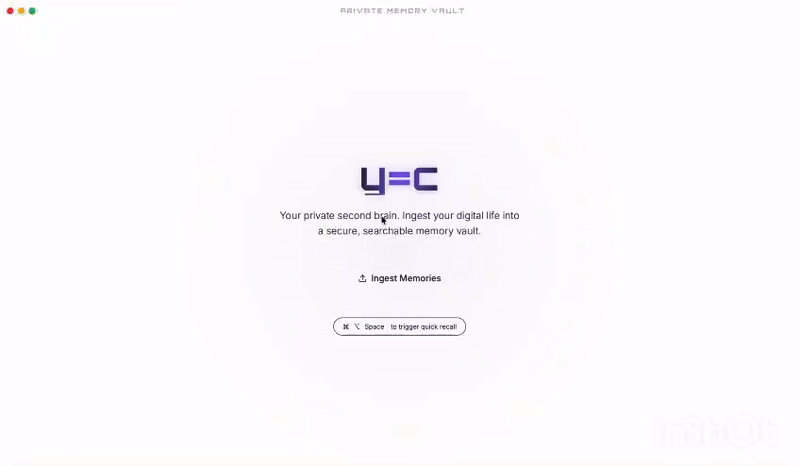

# y=c - Private Second Brain

> The cloud is dead. Long live the local.



**y=c** is a privacy-first personal knowledge management OS that aggregates your scattered LLM conversations (Claude, ChatGPT), Apple Notes, and documents into a secure, queryable second brain. Everything runs locally. No cloud. No telemetry. Your data never leaves your machine.

Think of it as **Obsidian for the AI era** — source-agnostic, local-first, and built on the principle that your thoughts belong to you.

## Why this exists

We generate thousands of conversations with AI every month — across Claude, ChatGPT, Gemini, Grok. Each conversation contains insights, decisions, and context that disappears into separate silos. **y=c** unifies them into a single, private, searchable memory layer.

The thesis is simple: **Personal. Private. Programmable.**

- **Personal** — your memories, your context, your second brain
- **Private** — zero cloud dependency, runs entirely on your hardware
- **Programmable** — open architecture, extensible ingestion pipeline, hackable by design

## What it does

- **Ingest** exported conversations from Claude, ChatGPT, and Apple Notes
- **Embed** everything locally using `BAAI/bge-small-en-v1.5` (no data leaves your machine)
- **Search** your memories with semantic vector search via LanceDB
- **Query** with natural language through the Memory Stream chat interface
- **Goose dyad** (optional): Coach-Player adversarial architecture that grounds every answer against source memories — the Player synthesizes, the Coach verifies

## The Coach-Player Architecture

y=c uses an adversarial cooperation pattern powered by [Goose](https://github.com/block/goose) (open-source AI agent by Block):

```
User Query
    |
    v
[Player] --- Retrieves memories, synthesizes a creative answer
    |
    v
[Coach] --- Verifies every claim against source documents
    |
    v
Grounded Answer + Confidence (HIGH / MEDIUM / LOW) + Sources
```

This prevents hallucination. The Player can be creative; the Coach keeps it honest. Both run locally.

## Architecture

```
Tauri (native desktop, ~5 MB binary)
  |
  React + Tailwind (frontend)
  |
  FastAPI (backend, port 8000)
  |
  +--> LanceDB (vector store, embedded)
  +--> sentence-transformers (local embeddings)
  +--> Goose CLI (optional, local LLM synthesis)
```

**Stack choices:**
- **Tauri** over Electron — 10x smaller binary, native performance, Rust security
- **LanceDB** over ChromaDB — embedded, no server process, Apache Arrow-native
- **Goose** over LangChain — autonomous agent framework, MCP-native, runs locally

## Prerequisites

- **Python 3.11+**
- **Node.js 18+** and npm
- **Rust** (for Tauri)
- **Goose CLI** (optional, for AI-synthesized answers)

### macOS

```bash
brew install rust python3 nodejs npm
```

## Setup

```bash
# Clone
git clone https://github.com/saravananjaichandaran/yequalsc.git
cd yequalsc

# Python dependencies
pip install -r requirements.txt

# Frontend dependencies
cd app && npm install && cd ..

# Start everything
./launch.sh
```

Or start services individually:

```bash
# Backend only
python -m backend.yc_server

# Frontend only
cd app && npm run tauri dev
```

## Usage

1. **First launch**: The app downloads the embedding model (~50 MB) automatically
2. **Ingest data**: Click "Begin Memory Upload" and select your sources
   - **Claude**: Export from claude.ai (Settings > Export Data), upload `conversations.json`
   - **ChatGPT**: Export from ChatGPT (Settings > Data Controls > Export), upload the zip or JSON
   - **Apple Notes**: Reads directly from the Notes app (grant permissions when prompted)
3. **Query**: Use the Memory Stream to ask questions about your past conversations
4. **File watcher**: Drop exports into `~/Downloads` — they're auto-detected and ingested

## Project Structure

```
yequalsc/
├── app/                    # Tauri + React frontend
│   ├── src/               # React components
│   └── src-tauri/         # Rust/Tauri native layer
├── backend/               # FastAPI server
│   ├── yc_server.py       # Main API
│   ├── goose_dyad.py      # Goose LLM integration (Coach-Player)
│   └── file_watcher.py    # Auto-detect exports in ~/Downloads
├── ingest/                # Data ingestion pipeline
│   ├── ingest_claude.py   # Claude export parser
│   ├── ingest_chatgpt.py  # ChatGPT export parser
│   ├── ingest_mac_notes.py # Apple Notes via JXA
│   ├── ingest_pdfs.py     # PDF ingestion
│   └── utils.py           # Embeddings, chunking, LanceDB ops
├── recipes/               # Goose dyad recipes
├── data/                  # Local data (gitignored)
│   ├── raw/               # User exports
│   └── memories/          # LanceDB vector store
├── launch.sh              # Start all services
└── requirements.txt       # Python dependencies
```

## Privacy

All processing happens locally. The embedding model runs on CPU. No data is sent to external services. The vector database lives in `data/memories/` on your machine. The app works fully offline after initial setup.

## Roadmap

- [ ] Multimodal ingestion — photos, screenshots, voice memos (Apple Vision framework)
- [ ] Grok and Gemini export support
- [ ] X/Twitter thread ingestion
- [ ] Peer-to-peer encrypted knowledge sharing (BitChat protocol)
- [ ] ENS-based identity resolution for shared contexts
- [ ] Dedicated hardware optimization for local 70B+ model inference

## Contributing

Contributions welcome. This is an open architecture — if you want to add a new ingestion source, improve the RAG pipeline, or optimize the Coach-Player dyad, open a PR.

## License

MIT License - see [LICENSE](LICENSE)
